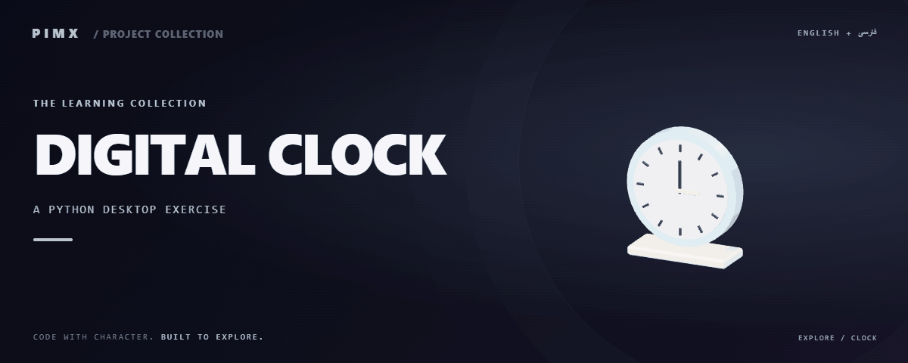

<div align="center">



**[English](README.md) · [فارسی](README.fa.md)**


</div>

# DIGITAL CLOCK

ساعت دیجیتال Tkinter که برچسب زمان را هر ۲۰۰ میلی‌ثانیه تازه می‌کند.

[GitHub](https://github.com/MOHAMMADREZAABEDINPOOR/clock) · [PIMX / Profile](https://github.com/MOHAMMADREZAABEDINPOOR) · [بنر ثابت](assets/readme/hero.png)

## امکانات

- نمایش زنده ساعت، دقیقه و ثانیه
- چیدمان برچسب Tkinter
- پنجره قابل تغییر اندازه

## پشته فنی

| ابزار | نسخه یا منبع |
|---|---|
| Python | `standard library / source imports` |

## شروع کار

Python 3 و محیط دسکتاپ برای پروژه‌های Tkinter/Turtle؛ Tkinter از اجزای نصب Python است و با pip نصب نمی‌شود. برای وابستگی‌های قدیمی از نسخه Python سازگار استفاده کنید.

```bash
git clone https://github.com/MOHAMMADREZAABEDINPOOR/clock.git
cd clock

python "clock.py"
```

## تنظیمات

فایل محیط استاندارد تعریف نشده است. برای تمرین‌های مستقل تنظیم خارجی لازم نیست؛ اگر در کد ثابت‌های سرویس یا مسیر وجود دارد، آن‌ها را پیش از اجرا بررسی کنید.

## استفاده

clock.py را در دسکتاپ با Tk اجرا کنید؛ برچسب از ساعت سیستم پیروی می‌کند.

## ساختار پروژه

| مسیر | نقش |
|---|---|
| [`assets/`](assets/) | فایل برند، رسانه و README |

## فرمان‌ها و بررسی

فرمان آزمون خودکار در manifest تعریف نشده است. اجرای محلی و بررسی رفتار نمونه را انجام دهید.

## استقرار

این تمرین محلی است و سرویس عمومی ندارد. برای تمرین وب میزبانی استاتیک کافی است.

## محدودیت‌ها

نمایش از منطقه زمانی سیستم استفاده می‌کند و زنگ ندارد.

## رفع مشکل

- رابط غایب: برای مثال Tkinter یا Turtle از Python دسکتاپ با Tk استفاده کنید.
- ورودی نامعتبر: قالب عدد و متن مورد انتظار فایل را وارد کنید.

## مشارکت

برای تغییر، شاخه مستقل بسازید، رفتار فعلی را بررسی کنید و توضیح روشن همراه تغییر بفرستید. اطلاعات خصوصی، خروجی build و دیتابیس محلی را commit نکنید.

## مجوز

فایل مجوز در این نسخه موجود نیست. نمایش عمومی کد به‌تنهایی مجوز استفاده مجدد نیست؛ برای شرایط استفاده با مالک مخزن هماهنگ کنید.

---

ساخته‌شده در مجموعه **PIMX** · مستندات فارسی و انگلیسی.
